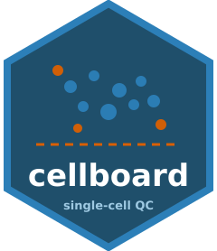
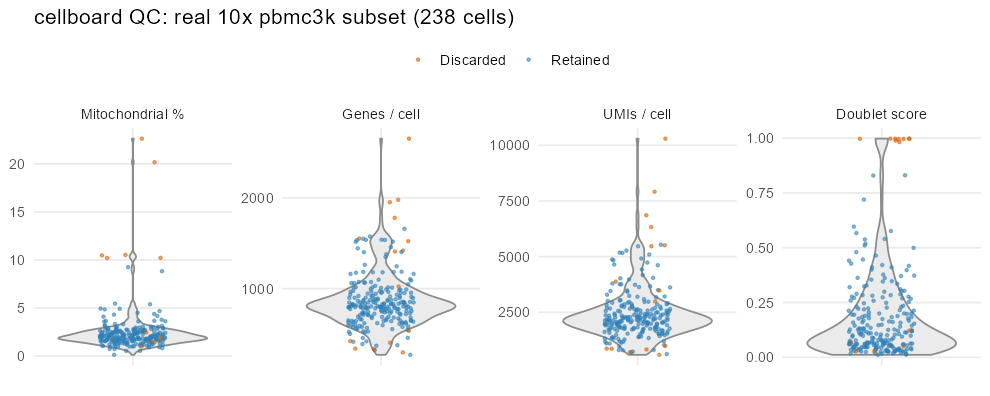
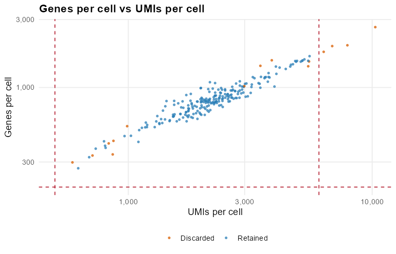

# cellboard 

<!-- badges: start -->
[](https://github.com/ashenoy/cellboard/actions/workflows/R-CMD-check.yaml)
[](https://www.gnu.org/licenses/gpl-3.0)
[](https://lifecycle.r-lib.org/articles/stages.html#experimental)
<!-- badges: end -->

**cellboard** is a Shiny dashboard for **code-free quality control of single-cell
RNA-seq data**, built on Bioconductor and deployable to
[Posit Connect](https://posit.co/products/enterprise/connect/). Point it at a
10x, `SingleCellExperiment`, or Seurat dataset; it computes per-cell QC metrics,
lets you set filtering thresholds with **live retained-vs-discarded feedback**,
and exports a filtered object plus a reproducible report — no scripting required.



---

## What it does

1. **Load** 10x Genomics (directory or `.h5`), a `SingleCellExperiment` `.rds`,
   or a Seurat object — or click **Load example PBMC**.
2. **Compute QC metrics**: mitochondrial %, genes per cell (`nGene`), UMIs per
   cell (`nUMI`), and [`scDblFinder`](https://bioconductor.org/packages/scDblFinder)
   doublet scores.
3. **Filter interactively**: drag threshold sliders and watch the violin/scatter
   plots, KPI boxes and the cell table update in real time.
4. **Export**: download the filtered `SingleCellExperiment` (`.rds`), the
   per-cell metrics (`.csv`), and an auto-generated, self-contained **HTML QC
   report**.

| Retained vs discarded scatter | Live dashboard |
| --- | --- |
|  | The sidebar holds data loading, the `Compute QC` button, and the threshold sliders; tabs cover **Data**, **QC overview**, **Filtering**, **Export** and **About**. |

## Installation

cellboard targets **R ≥ 4.2** and Bioconductor (≥ 3.18).

```r
# install.packages("remotes")
remotes::install_github("ashenoy/cellboard")
```

This pulls the Bioconductor dependencies (`SingleCellExperiment`, `scater`,
`scran`, `scDblFinder`, …). On a fresh machine, installing
[`BiocManager`](https://bioconductor.org/install/) first helps:

```r
install.packages("BiocManager")
BiocManager::install("ashenoy/cellboard")
```

## Quickstart

### Launch the dashboard

```r
library(cellboard)
run_app()
```

The app opens in your browser. Click **Load example PBMC**, then **Compute QC
metrics**, and explore.

### Use the QC engine from a script

Everything the app does is available programmatically:

```r
library(cellboard)

sce <- example_sce()                 # or read_input("filtered_feature_bc_matrix/")
sce <- compute_qc(sce)               # adds nUMI, nGene, pct_mito, doublet_score

th  <- qc_thresholds(
  min_genes            = 200,
  min_umi              = 500,
  max_mito             = 10,
  remove_doublet_class = TRUE
)

res <- apply_qc_filter(sce, th)
res$n_keep                           # cells retained
filtered <- res$filtered             # a filtered SingleCellExperiment
saveRDS(filtered, "filtered_sce.rds")

render_qc_report(res$sce, th, output_file = "qc_report.html")
```

### Supported inputs

| Input | How to load |
| --- | --- |
| 10x Cell Ranger directory | `read_input("filtered_feature_bc_matrix/")` |
| 10x HDF5 (`.h5`) | `read_input("raw_feature_bc_matrix.h5")` |
| `SingleCellExperiment` (`.rds`) | `read_input("sce.rds")` |
| Seurat object (`.rds`) | `read_input("seurat.rds", type = "seurat")` |
| In-memory Seurat / matrix | `as_sce(obj)` |

In the app you can upload a single `.rds`/`.h5`, or select the three 10x files
(`matrix.mtx.gz`, `barcodes.tsv.gz`, `features.tsv.gz`) together.

## Deploy to Posit Connect

cellboard ships as a standard Shiny app (`app.R` at the repo root) with a
Connect **manifest**. Three options:

**1. Push-button from the RStudio IDE / `rsconnect`:**

```r
install.packages("rsconnect")
rsconnect::writeManifest(appDir = ".", appPrimaryDoc = "app.R")  # -> manifest.json
rsconnect::deployApp(appDir = ".", appName = "cellboard", appPrimaryDoc = "app.R")
```

**2. Git-backed deployment.** In Connect, *Publish → Import from Git*, point at
this repository. Connect reads `manifest.json` / `renv.lock` and restores the
environment. Commit a refreshed manifest whenever dependencies change:

```r
rsconnect::writeManifest(appDir = ".", appPrimaryDoc = "app.R")
```

**3. CI/CD.** The included [`deploy-connect`](.github/workflows/deploy-connect.yaml)
workflow regenerates `manifest.json` on every push to `main`, uploads it as an
artifact, and deploys when these repository secrets are set:

| Secret | Value |
| --- | --- |
| `CONNECT_SERVER` | your Connect URL, e.g. `https://connect.example.com` |
| `CONNECT_API_KEY` | a Connect API key with publish rights |

> The app's `app.R` loads the bundled `R/` sources directly, so Connect only has
> to restore *dependencies* — it does not need cellboard pre-installed.

### Schedule the report on Connect

Publish `inst/report/qc_report.Rmd` as a parameterised report and set a schedule
under *(report) → Schedule* to e-mail a fresh QC summary (see the
[cookbook](vignettes/cookbook.Rmd) for a worked example).

## Cookbook

A full worked example — load a real public PBMC dataset, inspect QC, set
thresholds, export the filtered object, render the report, schedule it on
Connect, and hand off to a Seurat pipeline — lives in
[`vignettes/cookbook.Rmd`](vignettes/cookbook.Rmd):

```r
vignette("cookbook", package = "cellboard")
```

## Development

```r
# from a clone:
devtools::load_all()      # or: source the R/ files
devtools::test()          # run the testthat suite
devtools::check()         # R CMD check
```

The bundled example dataset (`inst/extdata/`) is a stratified **250-cell
subset of the real 10x pbmc3k** (hg19, v2 Cell Ranger output — 9,936 expressed
genes after filtering, with real high-mitochondrial and high-UMI outliers
preserved so the QC controls have genuine structure to act on). Generated by
`dev/make_example_data_real.R`. The cookbook downloads the full 2,700-cell
dataset and runs the identical pipeline end-to-end.

## How it fits together

```
app.R                 Connect / runApp() entry point (sources R/)
R/io.R                read_input(), read_10x(), read_sce(), read_seurat(), as_sce()
R/qc_metrics.R        compute_qc(), qc_thresholds(), apply_qc_filter(), summarise_qc()
R/plots.R             qc_violin(), qc_scatter(), qc_knee()
R/report.R            render_qc_report()
R/app_ui.R / app_server.R / run_app.R   the Shiny dashboard
inst/report/qc_report.Rmd               the reproducible report template
inst/extdata/                           bundled example dataset (10x + .rds)
```

## License

[GPL-3](LICENSE) © Amit Shenoy.

Built with [Bioconductor](https://bioconductor.org), [Shiny](https://shiny.posit.co),
[bslib](https://rstudio.github.io/bslib/) and
[plotly](https://plotly.com/r/).
